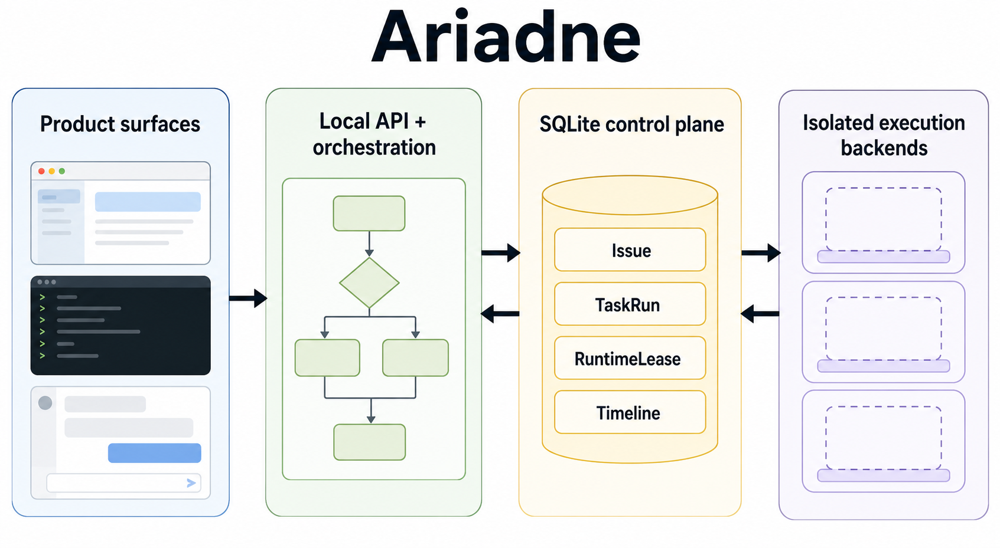
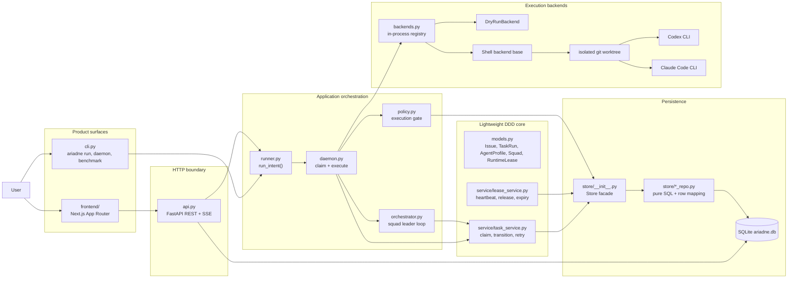
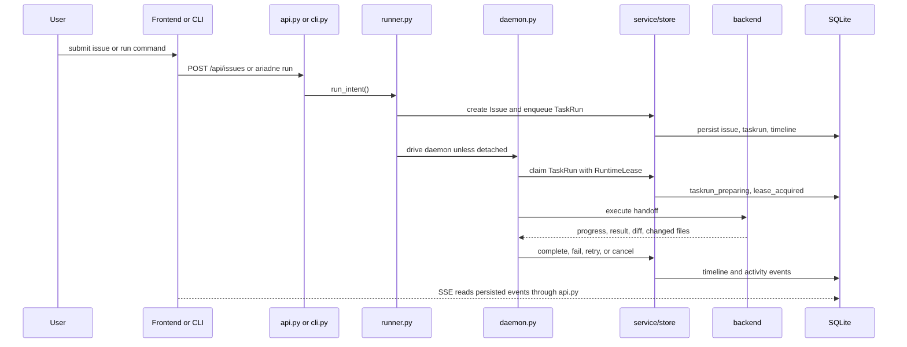
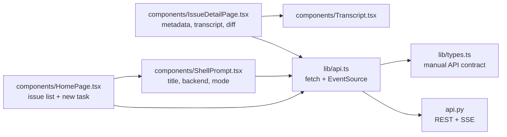
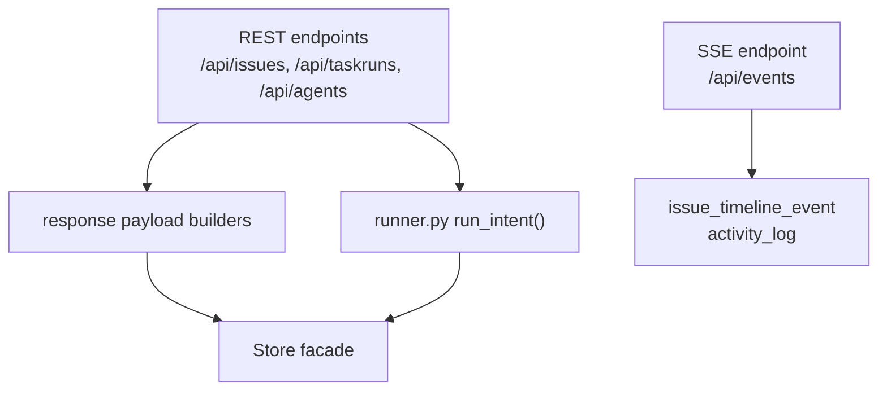
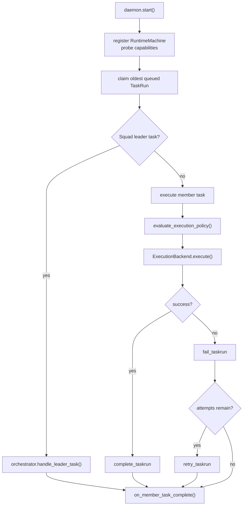
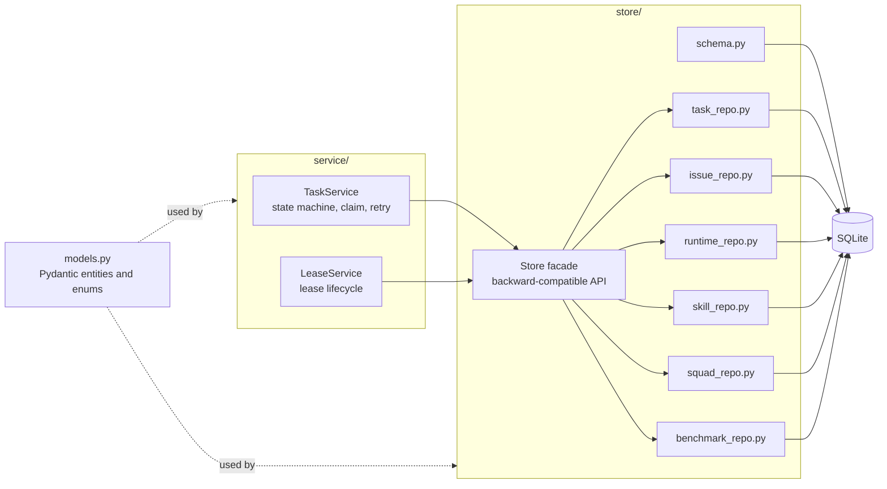
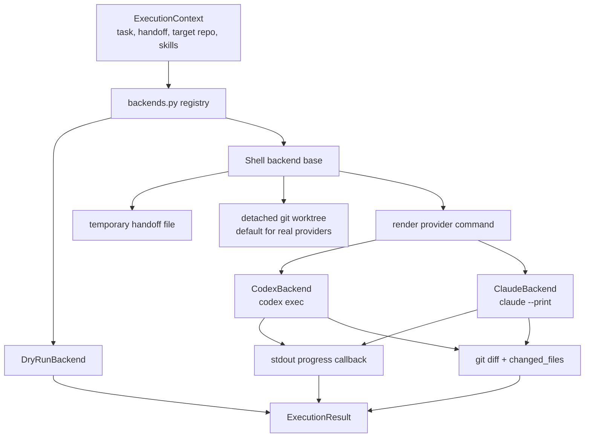
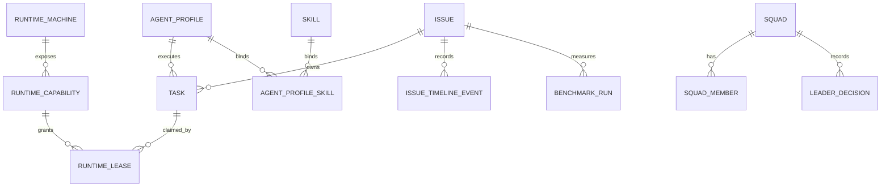

# Ariadne

Local managed-agent team runtime for coding work. Ariadne turns an issue into
durable TaskRuns, lets a Squad leader delegate work to member agents, runs
Codex or Claude Code through a pluggable backend, and records timeline, diff,
test, retry, and benchmark evidence in SQLite.

The product is local-first: one machine, one user, SQLite as the control plane,
and real provider execution isolated in git worktrees by default.



The image above is a visual overview. The Mermaid diagrams below are the
authoritative architecture map.

## Architecture



### Runtime flow



### Frontend module



The frontend is a separate Next.js project in `frontend/`. It does not import
Python, read SQLite, or share generated types with the backend. Its contract is
HTTP JSON plus SSE events.

### API and runner module



`api.py` is the HTTP boundary. It serializes data, exposes CORS for the local
Next.js app, and reuses `runner.py` for issue creation and execution. It should
not contain business rules or SQL that belongs in service or repository code.

### Daemon and orchestration module



The daemon is the local runtime loop. It registers the machine, claims TaskRuns
through leases, executes work, records progress, classifies failures, and
retries when the policy allows it.

### Domain services and persistence module



This is the first lightweight DDD cut. Repositories handle SQL and row mapping.
Services handle state transitions, claim rules, retry rules, and lease
lifecycle. The `Store` facade remains so older call sites keep working while
the internals move toward clearer boundaries.

### Execution backend module



Real provider backends spawn external CLIs. By default they run in a detached
worktree and capture the patch before cleanup. Direct writes to the target
workspace require the explicit `--write-workspace` escape hatch.

### Product facts



SQLite stores product facts, not just implementation logs. The UI, CLI,
benchmarks, and replay tooling all read from these facts.

## Implemented capabilities

- SQLite control plane: issues, TaskRuns, RuntimeMachines,
  RuntimeCapabilities, RuntimeLeases, AgentProfiles, Skills, Squads,
  LeaderDecisions, IssueTimeline events, ActivityLog entries, and
  BenchmarkRuns are persisted as product facts.
- Atomic runtime claim loop: the daemon claims queued TaskRuns, enforces one
  active TaskRun per issue, honors runtime and profile concurrency limits,
  executes work, classifies failures, and retries when policy allows it.
- Squad orchestration: a leader receives a structured briefing and emits
  `action`, `no_action`, `failed`, or `done`; member terminal states re-trigger
  leader evaluation.
- Shared intent runner: `ariadne run` and `POST /api/issues` use the same
  `runner.py` path instead of duplicating business logic in CLI and API code.
- Pluggable execution backends: dry-run, Codex, and Claude Code backends share
  the same in-process registry used by tests and benchmark providers.
- Isolation-first real execution: real providers run in detached git worktrees
  by default. Direct target writes require `--write-workspace`.
- Local Next.js frontend: the web UI lives in `frontend/`, calls only HTTP
  endpoints, and subscribes to persisted SSE events for live progress.
- Artifact-backed benchmarks: benchmark runners export manifests, metrics,
  SQLite facts, summaries, and hashes so reported numbers can be replayed.

## Quickstart

```bash
uv sync --extra dev
uv run ariadne run "Write a hello helper" --backend dry-run
```

Run multiple explicit tasks:

```bash
uv run ariadne run \
  "Write a hello helper" \
  "Write an add helper" \
  --backend dry-run
```

Run through a squad leader:

```bash
uv run ariadne run --squad "Refactor this module" --backend dry-run
```

Start the local API:

```bash
uv run ariadne api-serve
```

Start the local frontend in another shell:

```bash
cd frontend
npm install
npm run dev
```

Then open `http://localhost:3000`. The frontend expects the backend on
`http://localhost:8000` unless `NEXT_PUBLIC_API_BASE_URL` is set.

## Five-minute v1 demo

From a clean checkout:

```bash
uv sync --extra dev
uv run ariadne demo-v1 --reset
```

The demo creates a local dry-run squad, executes the daemon, and records
RuntimeMachines, RuntimeCapabilities, TaskRuns, RuntimeLeases, IssueTimeline
events, LeaderDecisions, and a BenchmarkRun. It does not require Codex, Claude,
or provider credentials.

Inspect the generated database:

```bash
export ARIADNE_DB=.ariadne-demo-v1/ariadne-v1.db
uv run ariadne runtime-list
uv run ariadne capability-list
uv run ariadne taskrun-list
uv run ariadne runtime-lease-list
uv run ariadne leader-decision-list
uv run ariadne benchmark-list
uv run ariadne api-serve
```

See [docs/demo-v1.md](docs/demo-v1.md) for the full verification path.

## Provenance

| Mechanism | Multica source | What Ariadne keeps | What Ariadne changes |
|-----------|----------------|--------------------|----------------------|
| Task state machine | migration 001 + 055 | States, failure classification, retry chain | SQLite and `BEGIN IMMEDIATE` instead of Postgres |
| Squad briefing | `squad_briefing.go` | Three-part briefing: protocol, roster, instructions | Structured `DelegationDecision` instead of mention markdown |
| Daemon claim loop | `daemon.go` | Poll, claim, execute, heartbeat, stale recovery | Local synchronous loop, SQLite storage, no hosted service |

See [docs/architecture/multica-mapping.md](docs/architecture/multica-mapping.md)
for the mechanism-by-mechanism mapping.

## Design decisions

1. SQLite over JSON or JSONL: state transitions need transactional integrity,
   but Ariadne does not need a server database.
2. Structured delegation over free-form mention text: `DelegationDecision` is
   testable, replayable, and validates against the squad roster.
3. LLM injected, not hardcoded: the orchestrator receives an `llm_decide`
   callable. Tests use deterministic decision logic.
4. Isolation is the default: real CLI execution uses detached git worktrees
   unless the caller explicitly passes `--write-workspace`.
5. Skills are capability packages: bound skills materialize prompt content,
   allowed tools, and verification commands into TaskRun handoffs.
6. Verification evidence is recorded, not used as a hidden hard gate: failed
   skill verification stays visible for leader re-evaluation.
7. Frontend and backend are separate projects: Python owns control-plane logic;
   Next.js owns UI and talks to the backend only through HTTP.

Detailed decision records live under [docs/adr](docs/adr/):

- [ADR 0010: Open Execution Backend Registry](docs/adr/0010-open-execution-backend-registry.md)
- [ADR 0011: Provider Session Resume and MCP Config Injection](docs/adr/0011-provider-session-resume-and-mcp-config.md)
- [ADR 0012: Skills as Capability Packages](docs/adr/0012-skills-as-capability-packages.md)
- [ADR 0013: Isolation-First Real Backend Execution](docs/adr/0013-isolation-first-real-backend-execution.md)

## Testing

```bash
uv run ruff check src/ariadne/
uv run pytest tests/ -v
cd frontend && npm test && npm run build
```

The backend suite covers state transitions, atomic claim, TaskRun
compatibility, runtime registration, leases, IssueTimeline events,
AgentProfiles, Skills, LeaderDecisions, ExecutionPolicy, BenchmarkRuns, squad
orchestration, backend isolation, backend registry extension, session resume,
MCP config injection, skill verification evidence, and the clean-checkout demo.

The frontend suite covers formatting helpers and the local browser smoke path.

## Benchmark evidence

Ariadne benchmark numbers are generated from artifact-backed runners rather
than terminal-only output. Each runner writes a run directory with metadata,
case manifest, metrics, exported SQLite product facts, summaries, and artifact
hashes.

```bash
uv run python benchmarks/runners/artifact_spine.py --artifact-dir artifacts/benchmarks/artifact
uv run python benchmarks/runners/control_plane_concurrency.py --tasks 500 --workers 16 --artifact-dir artifacts/benchmarks/control
uv run python benchmarks/runners/state_machine_recovery.py --artifact-dir artifacts/benchmarks/state
uv run python benchmarks/runners/squad_routing.py --artifact-dir artifacts/benchmarks/squad
uv run python benchmarks/runners/trace_replay.py --artifact-dir artifacts/benchmarks/trace
uv run python benchmarks/runners/real_backend_patch.py --provider synthetic --artifact-dir artifacts/benchmarks/real
uv run python benchmarks/runners/aggregate.py --artifact-dir artifacts
```

Dry-run, synthetic real-backend smoke, live Codex or Claude backend runs, LLM
routing, local pytest or ruff, and GitHub CI are reported as separate accounts.
CI pass rate is only reportable from GitHub checks. Local pytest is not a
substitute for CI. Live Codex or Claude patch success requires the provider CLI
and is not mixed with dry-run or synthetic smoke results.

Current comparison output using `--backend dry-run` is simulated and must be
reported as simulated. Real Codex or Claude comparison numbers remain unfilled
until a real environment with provider CLI credentials runs
`ariadne benchmark-compare --backend codex` or
`ariadne benchmark-compare --backend claude-code`.

## Project structure

```text
src/ariadne/
├── api.py                 # FastAPI REST + SSE boundary
├── cli.py                 # Typer CLI entry point
├── runner.py              # Shared intent runner for CLI and API
├── daemon.py              # Poll, claim, execute, heartbeat, retry
├── orchestrator.py        # Squad leader delegation loop
├── briefing.py            # Squad briefing generation
├── llm_decide.py          # OpenAI-compatible leader decision adapter
├── backends.py            # DryRun, Codex, Claude, registry, isolation, diff
├── policy.py              # Layered ExecutionPolicy gate
├── eval.py                # BenchmarkRun from product facts
├── benchmarking.py        # Artifact-backed benchmark runners
├── models.py              # Pydantic domain models and enums
├── service/
│   ├── task_service.py    # TaskRun state machine, claim, retry
│   └── lease_service.py   # RuntimeLease lifecycle
└── store/
    ├── __init__.py        # Store facade
    ├── schema.py          # SQLite schema
    ├── base.py            # connection, transaction, row mapping
    ├── task_repo.py
    ├── issue_repo.py
    ├── runtime_repo.py
    ├── skill_repo.py
    ├── squad_repo.py
    └── benchmark_repo.py

frontend/
├── app/                   # Next.js App Router pages
├── components/            # Terminal UI components
├── lib/                   # API client, types, formatting
└── package.json           # Independent frontend dependencies

benchmarks/runners/        # External benchmark runner entry points
tests/                     # Backend test suite
docs/                      # Architecture docs, ADRs, delivery plan, assets
```

`src/ariadne/dashboard.html` still exists as a legacy inspection dashboard. New
UI work belongs in `frontend/`; the legacy HTML file should be removed once the
Next.js frontend covers the needed inspection path.

## Current limitations

- `POST /api/issues` currently reuses `runner.py` directly. It works for
  dry-run and small real tasks, but long real-provider tasks still need better
  detached execution and heartbeat UX.
- `IssueStatus` has no first-class `failed` state yet. Failed TaskRuns are
  visible, but issue-level failure semantics need hardening.
- Some older CLI, API, benchmark, and policy paths still read SQLite through
  the `Store` connection for narrow reporting queries. New business logic
  should go through services and repositories.

## Non-goals

- No hosted multi-tenant service.
- No auth, billing, Postgres, Redis relay, or distributed scheduler.
- No RAG, vector database, or knowledge pipeline in this runtime.
- No autopilot, scheduled inbox work, Feishu sync, GitHub issue sync, or memory
  product layer.
- No full Multica clone. Ariadne keeps the local mechanisms it needs and leaves
  the SaaS shell out.
